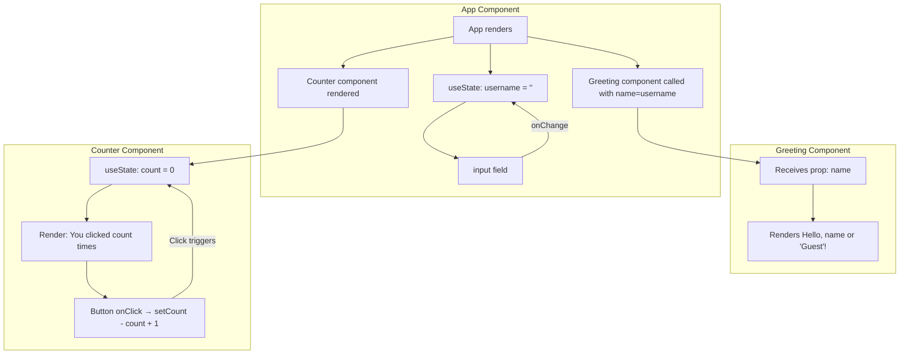

```mermaid
graph TD

subgraph App Component
    A1[App renders]
    A2[useState: username = '']
    A3[input field]
    A4[Greeting component called with name=username]
    A5[Counter component rendered]
end

subgraph Greeting Component
    G1[Receives prop: name]
    G2[Renders Hello, name or 'Guest'!]
end

subgraph Counter Component
    C1[useState: count = 0]
    C2[Render: You clicked count times]
    C3[Button onClick → setCount - count + 1]
end

A1 --> A2
A2 --> A3
A3 -->|onChange| A2
A1 --> A4
A4 --> G1 --> G2
A1 --> A5
A5 --> C1 --> C2
C2 --> C3
C3 -->|Click triggers| C1
```